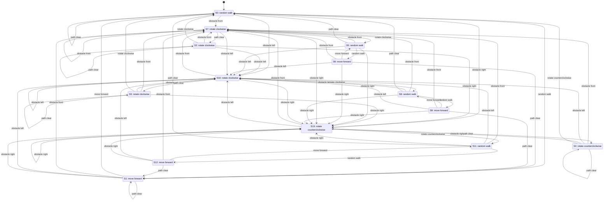

# Robot Behavior State Machine

Source YAML: `explore_sup_gpt_long_1_run_6_104.yaml`

State labels are inferred from the controllable events enabled in each state.

## State Summary

- `S0`: Initial state. Behavior `random walk`. Transitions: obstacle front -> S7, obstacle left -> S10, obstacle right -> S13, path clear -> S0, random walk -> S1.
- `S1`: Behavior `move forward`. Transitions: move forward -> S0, obstacle front -> S7, obstacle left -> S10, obstacle right -> S13, path clear -> S1.
- `S2`: Behavior `rotate clockwise`. Transitions: obstacle front -> S7, obstacle left -> S10, obstacle right -> S13, path clear -> S2, rotate clockwise -> S0.
- `S3`: Behavior `rotate clockwise`. Transitions: obstacle front -> S7, obstacle left -> S10, obstacle right -> S13, path clear -> S3, rotate clockwise -> S0.
- `S4`: Behavior `rotate counterclockwise`. Transitions: obstacle front -> S7, obstacle left -> S10, obstacle right -> S13, path clear -> S4, rotate counterclockwise -> S0.
- `S5`: Behavior `random walk`. Transitions: obstacle front -> S7, obstacle left -> S10, obstacle right -> S13, path clear -> S0, random walk -> S6.
- `S6`: Behavior `move forward`. Transitions: move forward -> S5, obstacle front -> S7, obstacle left -> S10, obstacle right -> S13, path clear -> S1.
- `S7`: Behavior `rotate clockwise`. Transitions: obstacle front -> S7, obstacle left -> S10, obstacle right -> S13, path clear -> S2, rotate clockwise -> S5.
- `S8`: Behavior `random walk`. Transitions: obstacle front -> S7, obstacle left -> S10, obstacle right -> S13, path clear -> S0, random walk -> S9.
- `S9`: Behavior `move forward`. Transitions: move forward -> S8, obstacle front -> S7, obstacle left -> S10, obstacle right -> S13, path clear -> S1.
- `S10`: Behavior `rotate clockwise`. Transitions: obstacle front -> S7, obstacle left -> S10, obstacle right -> S13, path clear -> S3, rotate clockwise -> S8.
- `S11`: Behavior `random walk`. Transitions: obstacle front -> S7, obstacle left -> S10, obstacle right -> S13, path clear -> S0, random walk -> S12.
- `S12`: Behavior `move forward`. Transitions: move forward -> S11, obstacle front -> S7, obstacle left -> S10, obstacle right -> S13, path clear -> S1.
- `S13`: Behavior `rotate counterclockwise`. Transitions: obstacle front -> S7, obstacle left -> S10, obstacle right -> S13, path clear -> S4, rotate counterclockwise -> S11.
